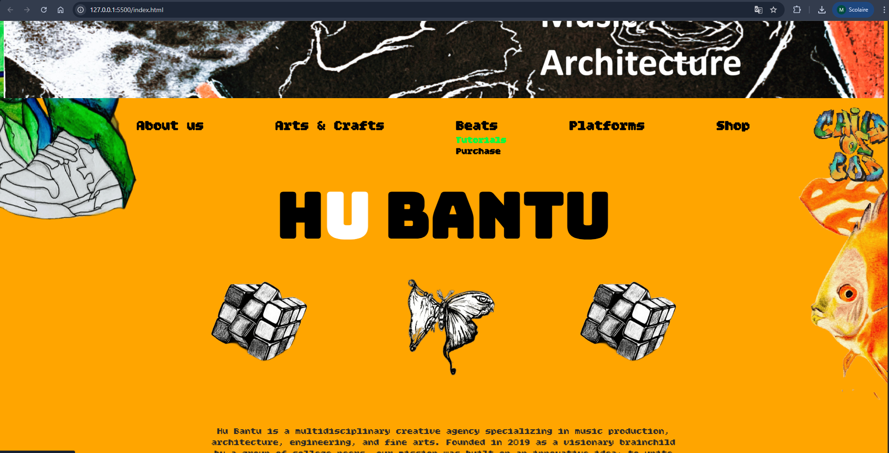

# HU BANTU - Creative Agency Website

A visually immersive landing page built for a multidisciplinary creative agency. This project combines bold, artistic CSS layouts with dynamic JavaScript elements to create a unique user experience designed to feel as interactive and engaging as a video game or movie environment. This is an ongoing project for the HuBantu architecture and art agency
## Technical Highlights

### Dynamic Typography (JavaScript)
I implemented a custom script that processes the "About Us" section by:
- Splitting the text into individual words.
- Injecting them into the DOM as spans.
- Assigning random HSL color variables to each word dynamically.
- Creating an interactive hover effect where words change color based on their unique generated values.

### Advanced CSS Styling
- **Complex Layouts:** Used CSS pseudo-elements (`::before`, `::after`) with fixed positioning to create artistic sidebars (`fish.png`, `shoes.png`) that stay in place while scrolling.
- **Custom Navigation:** Built a responsive flexbox-based menu with custom dropdowns and per-link color themes.
- **Visual Branding:** Implemented a "collage" aesthetic using multiple image layers, custom font integrations (Google Fonts), and a consistent orange-heavy color palette.

### Responsive Design
- Included Media Queries to handle layout shifts for screens under 800px.
- Managed complex image scaling to maintain the artistic integrity of the page on smaller devices.

## Tech Stack
- **HTML5:** Semantic structure for accessibility.
- **CSS3:** Flexbox, pseudo-elements, custom variables, and transitions.
- **JavaScript (Vanilla):** DOM manipulation, Math-based random styling, and event handling.

## Project Status: Work In Progress
- [x] Artistic layout and background integration.
- [x] Dynamic color-shifting text script.
- [x] Interactive dropdown navigation.
- [ ] Finalizing mobile-specific styles for the image collage.
- [ ] Connection to the Shop and Beats functional sub-pages.

## Preview

### Desktop View

### Interaction Demo

---
*Developed as an exploration of artistic web design and JavaScript DOM manipulation.*
